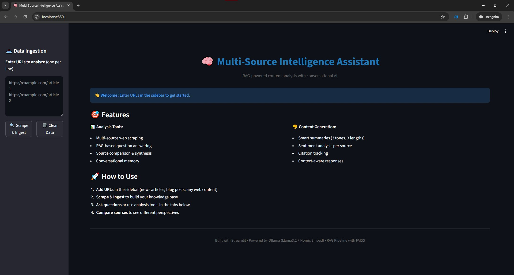
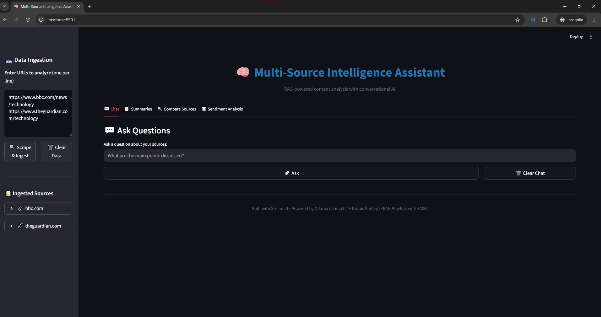
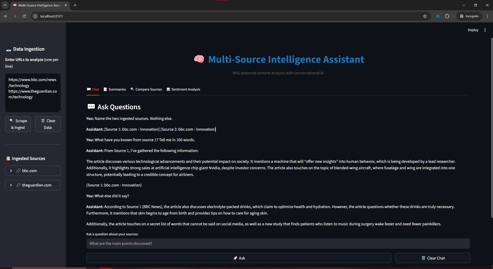
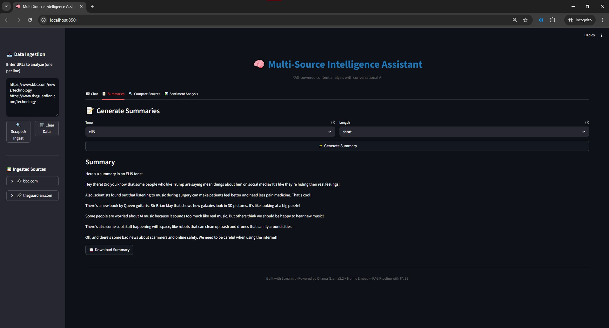
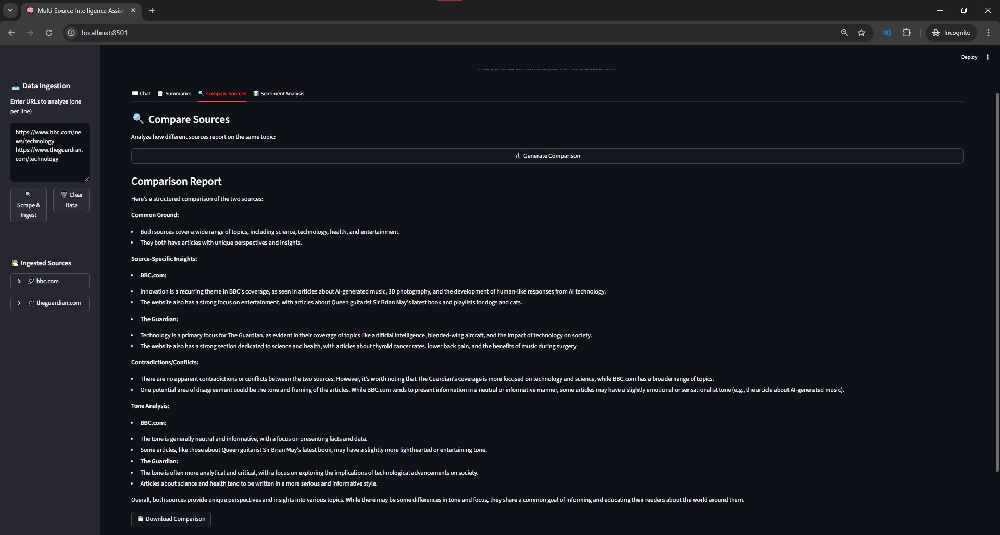
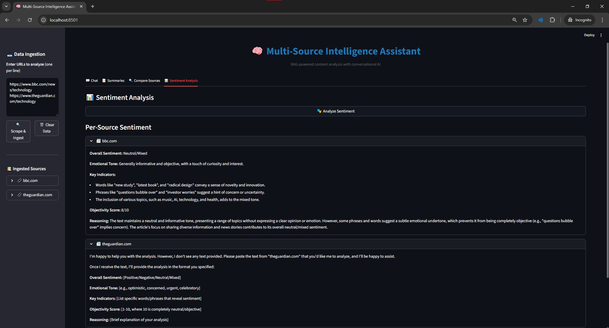

# >� Multi-Source Intelligence Assistant

A powerful **RAG-powered** (Retrieval-Augmented Generation) content analysis system that enables intelligent questioning, summarization, and comparison of multiple web sources. Built with Streamlit, LangChain, and Ollama for completely **local AI inference** - no API keys required!

[](https://www.python.org/downloads/)
[](https://streamlit.io)
[](https://langchain.com)
[](https://ollama.ai)

---

## <� Features

### =� Analysis Tools
- **Multi-source web scraping** - Extract content from any webpage with intelligent parsing
- **RAG-based question answering** - Ask questions across multiple sources with semantic search
- **Source comparison & synthesis** - Analyze how different sources report on the same topic
- **Conversational memory** - Context-aware conversations that remember previous exchanges

### <� Content Generation
- **Smart summaries** - Generate summaries in 3 tones (casual, formal, ELI5) and 3 lengths (short, medium, long)
- **Sentiment analysis** - Per-source sentiment and emotional tone analysis
- **Citation tracking** - Automatic source attribution for all responses
- **Context-aware responses** - Uses RAG to ground answers in your ingested content

---

## =� Screenshots

### Welcome Screen


### Data Ingestion


### Chat Interface


### Summary Generation


### Source Comparison


### Sentiment Analysis


---

## =� Getting Started

### Prerequisites

- **Python 3.11+**
- **Ollama** ([Download here](https://ollama.ai))
- **Git**

### Installation

1. **Clone the repository**
   ```bash
   git clone https://github.com/RageebRidwan/News-Intelligence-Assistant.git
   cd News-Intelligence-Assistant
   ```

2. **Create a virtual environment**
   ```bash
   python -m venv venv

   # On Windows
   venv\Scripts\activate

   # On macOS/Linux
   source venv/bin/activate
   ```

3. **Install dependencies**
   ```bash
   pip install -r requirements.txt
   ```

4. **Pull required Ollama models**
   ```bash
   ollama pull llama3.2
   ollama pull nomic-embed-text
   ```

5. **Start Ollama** (keep it running in the background)
   ```bash
   ollama serve
   ```

6. **Run the application**
   ```bash
   streamlit run frontend/app.py
   ```

7. **Open your browser** to `http://localhost:8501`

---

## =� Project Structure

```
news-intelligence-assistant/


